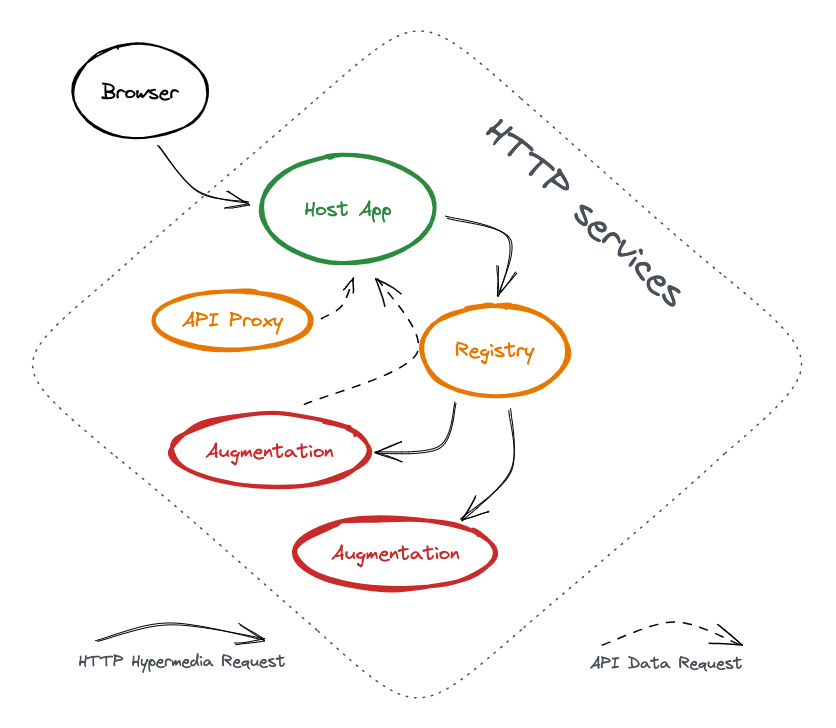

# Augmented Hypermedia Architecture

## Overview of Services

The augmented hypermedia _system_ consists of three types of service:

- The **Host** application
- The **Registry** of augmentations
- The third-party **Augmentations**



The diagram illustrates the flow of HTTP requests between the services, we
consider everything in this diagram as part of the '_system_'.

This is a typical configuration to keep the diagram simple, but in reality a
host app may connect with many registries, and a registry could serve many host
apps. The registry may also be entirely embedded within the host app, along with
built-in augmentations. There is a lot of flexibility, but for the sake of
discussion we'll think of each of these as a distinct HTTP service.

### The Host Application

This is a web application that wishes to be extensible by third-party
augmentation of it's UI.

### The Registry

This service provides a number of functions:

- a UI and API to register **augmentations** for the **host** app
- a server to supply the JS and CSS of the _system_ to the **host** app
- a proxy for hypermedia requests between the **host** and the **augmentations**
- sanitizing of **augmentation** content
- (future?) a proxy for API requests from the **augmentations** to the **host**

### The Augmentations

These are third-party services that provide declarative hypermedia augmentations
for the **host** application.

An **augmentation** is registered with a **registry** associated with the
**host** app.

## What actually is an Augmentation?

It starts with a set of rules that declare where to apply augmentations to the
UI of the host app.

The actual augmentations are simple fragments of HTML enhanced with declarative
hypermedia extensions provided by [htmx](https://htmx.org/), and therefore do
not require any client-side scripting.

Thanks to this purely declarative model, the **host** can have complete control
over what an **augmentation** is permitted to do in its UI.

The **augmentation** service can be implementing using whatever language or
framework you prefer, so long as it can serve up HTML and CSS over HTTP.

### Augmentation Rules

For convenience and familiarity we use CSS (Cascading StyleSheets) as the
language of our rules, leveraging
[custom properties](https://developer.mozilla.org/en-US/docs/Web/CSS/--*) to
provide us with additional features beyond the usual CSS capabilities.

The rules allows us to target elements within the **host** UI, and identify
where to to apply augmentations.

Rules should be structured into at least two or more CSS files, with a very
simple `entrypoint` file containing just the rules necessary identify when it
should load the rest of its rules.

```css
[data-url-path$="/quiz"] {
  --css-rule-import: url("main.css");
}
```

This declares that an additional CSS file (`main.css`) should be imported if the
current URL ends in `/quiz`.

_But that's not regular CSS, how is that actually going to work, and how does
the host app load this initial entrypoint?_

Good question, thanks for asking!

The **registry** supplies a single JavaScript file contain all the client-side
behaviour necessary for the _system_ and a single CSS file that imports all the
_entrypoints_ of the registered and enabled **augmentations**.

The client-side JS contains the [htmx](https://htmx.org/) library and a handful
of scripts and htmx extensions specifically created to support hypermedia
augmentations.

#### data-url

The first script is the simplest, [data-url](./data-url.md), this add several
`data-url-*` attributes to the root `html` element containing the current
`document.location`.

For example:

```html
<html data-url-href="http://example.com/quiz#question" data-url-host="example.com" data-url-path="/quiz" data-url-hash="#question">
```

This gives our CSS rules the ability to filter based on the current URL using an
[attribute selector](https://developer.mozilla.org/en-US/docs/Web/CSS/Attribute_selectors).

#### css-rules

The next script, or [htmx extension](https://htmx.org/docs/#extensions) is
[css-rules](./css-rules.md), this is what enhances our CSS rules with additional
capabilities using custom properties. It will scan all loaded stylesheets for
the custom properties it can handle and apply augmentations to the page, these
may be in the form of loading more stylesheets (as is the case for
`--css-rule-import`), inserting _pseudo_ elements into the page, or copying
properties from the rule as attributes in the document and
[activating _htmx_ behaviours](https://htmx.org/api/#process) on those elements.

### Hypermedia

_TODO: Brief intro to htmx and hypermedia concepts_

For now please take a look at [htmx](https://htmx.org/) itself.

## A Complete Ecosystem

So far we've just discussed the architecture of the _Augmented Hypermedia_
system.

This is intended to become part of a larger ecosystem for the **host** app,
where features beyond just UI augmentations, web-hooks for example, can be added
by third-parties.

We'll refer to this combination of augmentation, web-hooks, and other features
as an _addon_.

Users will need a _marketplace_ to discover _addons_ and to install them.

This diagram illustrates how our _Augmented Hypermedia_ services could fit into
a larger _marketplace_ system...


The **marketplace** itself would have some registration system to which
third-party vendors would submit details of their _addons_.

The **marketplace** would delegate the task of _addon_ installation to a
**registrar** service which would require knowledge of the particular _addon_
ecosystem and the **host** app to be able to install _addon_ features beyond the
augmentations.

The diagram illustrates a reference implementation, but it could be that the
**registrar** is part of the **marketplace**, or the **host** app itself.

It could be that the **marketplace** is just an _augmentation_ or _addon_ of the
**host** app too, appearing to be seamlessly integrated.
